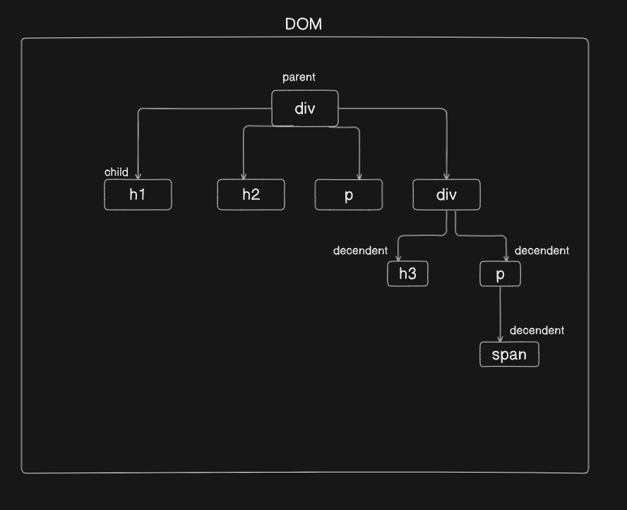

# CSS Playground

## What is css do :

- Css actually do two things one is select the html element and then style that element.

## How style is done is Html:

- There are three possible way to style any element
  1. Inline styling - We can add style attribute and set some styleing properties inside in a tag, like eg- `<h1 style="color: blueviolet">Lorem ipsum dolor sit.</h1>`
  2. style tag - We can add a style tag in the same file of html and inside it we can specify the element which we want to style and add styles
  3. css file - We can create a css file and put all style properties there and link the file inside the html file for style the element.

## DOM(Document Object Model) sturcture :

- Dom is a tree like structure where all component of html in page is placed or structured. Below image illustrate this
  

## Selector in css :

- Universal selector : It can select all elements in html file and we can style them in one place. Basically it is used to flush out all default styleing manage by browser. It is activated by : `* {}`
- Type Selector : A type selector in CSS is used to select all elements of a given type within a document.
- Class Selector : A class selector in CSS is used to select elements with a specific class attribute. To use a class selector, you write a period (.) followed by the class name.
- ID Selector : An ID selector in CSS is used to select a single, unique element on a page. To use an ID selector, you write a hash (#) followed by the ID of the element.
- Attribute Selector : An attribute selector in CSS allows you to select elements based on their attributes or attribute values. This can be very powerful for targeting specific elements without needing to add extra classes or IDs
- Descendant Selector : A descendant selector in CSS is used to select elements that are descendants of a specified element. This means it will select all children, grandchildren, great-grandchildren, and so on, of the specified ancestor element.
- Child Selector : A child selector in CSS is used to select elements that are direct children of a specified element. This selector is represented by the > symbol between two selectors. It is stricter than the descendant selector, as it only targets immediate children, not deeper nested elements
- Adjacent Sibling Selector : An adjacent sibling selector in CSS is used to select an element that is directly after another specific element, provided they share the same parent. This selector is represented by the + symbol.
- General Sibling Selector : The general sibling selector in CSS is used to select all elements that are siblings of a specified element and come after it, sharing the same parent. This selector is represented by the `~` symbol.
- Pseudo-classes selector : A pseudo-class in CSS is a keyword added to a selector that specifies a special state of the selected element. Pseudo-classes are used to style elements based on their state, position, or user interaction. Eg `:hover`
- Pseudo-elements selector : A pseudo-element in CSS is a keyword added to a selector that allows you to style a specific part of the selected element. Pseudo-elements are used to style certain parts of an element, such as the first letter or line, or to insert content before or after an element’s content.
- Grouping Selector

## SVG Waves in CSS :

- We can go to this link <link>https://getwaves.io/</link>

## Flexbox in CSS :

- Flexbox has two axis one is Main axis and Other axis
  1. Main axis is basically left to right or say horizontal axis

## Grid in CSS :

-
